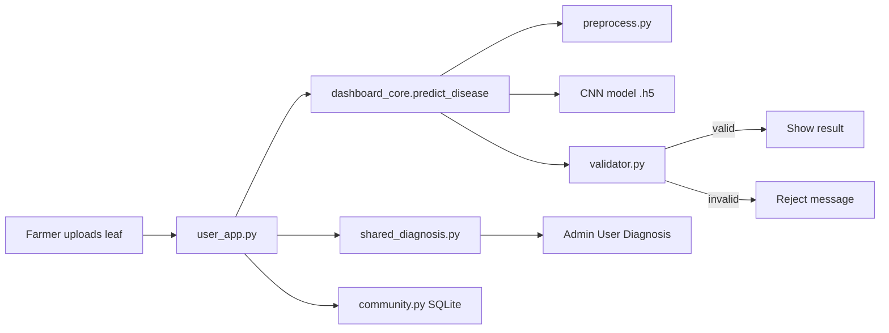

# Maize Leaf Care — Line-by-Line Code Explanation (Panel Presentation)

**Project:** Early Detection of Maize Leaf Diseases in Tanzania  
**Institution:** EASTC — Bachelor of Data Science  
**Stack:** Python · TensorFlow/Keras · Streamlit · OpenCV · SQLite  

Use this document to explain **what each line does** during your panel defense tomorrow.

---

## 1. What to Say First (2-minute opening)

> “Our system uses a **Custom CNN** trained on 4,188 maize leaf images to classify four conditions: Healthy, Common Rust, Northern Leaf Blight, and Cercospora Leaf Spot. We built **two Streamlit dashboards**: **Maize Leaf Care** for farmers (simple advice) and an **Admin Dashboard** for lecturers (full probabilities and model metrics). Before showing results, a **validator** rejects non-maize images like mango or sugarcane. Farmers can also use **Community Help** to ask questions and receive **Admin** replies.”

**Live demo order:**

1. Run `start_both.bat` → User **8501**, Admin **8502**
2. Upload a real leaf on User Dashboard → show disease + management
3. Switch to Admin → **User Diagnosis** → show full technical results
4. Optional: submit Community Help → reply as Admin

---


## 2. Project Architecture




| File                        | Role                                 |
| --------------------------- | ------------------------------------ |
| `user_app.py`               | Farmer dashboard (Maize Leaf Care)   |
| `app.py`                    | Admin / lecturer dashboard           |
| `utils/dashboard_core.py`   | Load model + run prediction          |
| `utils/preprocess.py`       | Resize image to 128×128 for CNN      |
| `utils/validator.py`        | Reject non-maize uploads             |
| `utils/labels.py`           | Class names, disease info, metrics   |
| `utils/shared_diagnosis.py` | Sync user uploads → admin            |
| `utils/community.py`        | SQLite database for help posts       |
| `utils/community_ui.py`     | Community Help screens               |
| `utils/translations.py`     | English / Kiswahili text             |
| `launch_both.py`            | Start both apps on ports 8501 & 8502 |


---


## 3. `launch_both.py` — Start Both Dashboards


| Line  | Code                                        | Explanation                                                       |
| ----- | ------------------------------------------- | ----------------------------------------------------------------- |
| 1     | `"""Stop old..."""`                         | Docstring: describes script purpose                               |
| 3     | `from __future__ import annotations`        | Allows modern type hints in older Python                          |
| 5–8   | `import subprocess, sys, time, Path`        | Run OS commands, exit codes, delay, file paths                    |
| 10    | `ROOT = Path(__file__).resolve().parent`    | Project folder path (where this file lives)                       |
| 13    | `def main()`                                | Entry function                                                    |
| 14    | `subprocess.run([..., stop_dashboards.py])` | Kill old Streamlit processes on 8501/8502                         |
| 15    | `time.sleep(1)`                             | Wait 1 second so ports are free                                   |
| 17–25 | `user_cmd = [...]`                          | Command: `python -m streamlit run user_app.py --server.port 8501` |
| 26–34 | `admin_cmd = [...]`                         | Same for `app.py` on port **8502**                                |
| 36    | `CREATE_NEW_CONSOLE` (Windows)              | Opens each app in a **new terminal window**                       |
| 37–38 | `subprocess.Popen(...)`                     | Start User and Admin **in parallel** (background)                 |
| 40–41 | `print(...)`                                | Show URLs in console                                              |
| 44–45 | `if __name__ == "__main__"`                 | Run `main()` only when executed directly                          |


---


## 4. `user_app.py` — Farmer Dashboard (Maize Leaf Care)


### Lines 1–24 — Imports and setup


| Line  | Explanation                                        |
| ----- | -------------------------------------------------- |
| 1     | Module docstring: farmer-facing app                |
| 3     | `io` — read uploaded file bytes in memory          |
| 4     | `Path` — handle file paths                         |
| 6     | `streamlit as st` — web UI framework               |
| 7     | `PIL.Image` — open and display images              |
| 9     | Community Help UI components + CSS                 |
| 10–16 | Shared functions: load model, predict, page header |
| 17    | Save diagnosis batch for admin to read             |
| 18    | Global theme colors and CSS                        |
| 19    | Translation helper `t()` for EN/SW                 |
| 21–24 | Internal page name map (Diagnose, Community Help)  |


### Lines 26–99 — Page styling and config


| Line  | Explanation                                                                                     |
| ----- | ----------------------------------------------------------------------------------------------- |
| 26–90 | `USER_PAGE_CSS` — green cards, shadows, upload panel styling (HTML/CSS injected into Streamlit) |
| 92–97 | `st.set_page_config` — browser tab title **Maize Leaf Care**, corn icon, wide layout            |
| 99    | Inject global + user + community CSS into the page                                              |


### Lines 102–105 — Language memory


| Line    | Explanation                                       |
| ------- | ------------------------------------------------- |
| 102     | `get_language()` — returns user's language choice |
| 103–104 | First visit: default language = English (`"en"`)  |
| 105     | Return stored language from session               |


### Lines 108–140 — Sidebar


| Line    | Explanation                                             |
| ------- | ------------------------------------------------------- |
| 109–115 | Show app title and subtitle (translated)                |
| 117–123 | Language dropdown: English / Kiswahili                  |
| 124–126 | If language changed → save and refresh page             |
| 128     | Build menu labels in current language                   |
| 129–133 | Radio buttons: **Diagnose** or **Community Help**       |
| 135–138 | “How to use” instructions in sidebar                    |
| 140     | Return selected page id (`"diagnose"` or `"community"`) |


### Lines 143–175 — Show one diagnosis result


| Line    | Explanation                                                                    |
| ------- | ------------------------------------------------------------------------------ |
| 143     | `render_single_result` — display one image result                              |
| 144–148 | Show filename if provided                                                      |
| 150–156 | If **invalid** (validator rejected): show orange reject panel                  |
| 158     | Get disease name in selected language                                          |
| 159     | Pick color bar for this disease class                                          |
| 160–175 | HTML panel: disease name, scientific name, confidence %, **management advice** |


### Lines 178–189 — Process all uploads


| Line    | Explanation                                                                   |
| ------- | ----------------------------------------------------------------------------- |
| 178     | `process_uploads` — loop through all uploaded files                           |
| 182–186 | For each file: show spinner → open image → **predict_disease** → store result |
| 188     | Save entire batch to `shared/` folder for admin                               |
| 189     | Return list of `(image, result, filename)` tuples                             |


### Lines 192–257 — Diagnose page layout


| Line    | Explanation                                                                      |
| ------- | -------------------------------------------------------------------------------- |
| 192     | `page_diagnose` — main upload screen                                             |
| 193–196 | Page title + subtitle                                                            |
| 198     | Two columns: upload (left) vs results (right)                                    |
| 200–217 | Left: bordered panel with file uploader (jpg/png, multiple files)                |
| 219–225 | Preview thumbnails of selected images                                            |
| 227–254 | Right: if no upload → empty state; else run prediction and show each result card |
| 256–257 | After valid diagnosis → show **“Need more help?”** form                          |


### Lines 260–280 — Main entry


| Line    | Explanation                                                       |
| ------- | ----------------------------------------------------------------- |
| 260     | `main()` — app controller                                         |
| 261–262 | Get language + sidebar page                                       |
| 264–268 | Load CNN model once; stop with error if `.h5` missing             |
| 270–273 | Route to Community Help or Diagnose page                          |
| 276–277 | If run as `python user_app.py` → auto-start Streamlit on **8501** |
| 279–280 | If already inside Streamlit → call `main()`                       |


---


## 5. `app.py` — Admin Dashboard


### Lines 1–43 — Setup


| Line  | Explanation                                        |
| ----- | -------------------------------------------------- |
| 1     | Admin app docstring                                |
| 5     | `pandas` — tables for metrics and confusion matrix |
| 9–16  | Import prediction + image helpers                  |
| 17–23 | Class names, metrics, confusion matrix constants   |
| 24    | Community Help page (admin mode)                   |
| 25    | Read latest user uploads from `shared/`            |
| 28–34 | Admin menu pages map                               |
| 36–43 | Page config + CSS (admin uses global theme only)   |


### Lines 46–61 — Probability bars


| Line  | Explanation                                        |
| ----- | -------------------------------------------------- |
| 46    | Build HTML bar chart for all 4 class probabilities |
| 47    | Sort classes highest → lowest                      |
| 50–51 | Match display name to color                        |
| 52    | Bold label for winning class                       |
| 54–59 | HTML: class name, %, colored progress bar          |


### Lines 63–93 — Full diagnosis (admin upload)


| Line  | Explanation                                          |
| ----- | ---------------------------------------------------- |
| 63    | `render_full_diagnosis_result` — technical view      |
| 65–70 | Rejection panel if invalid                           |
| 72–83 | Result card: disease, scientific name, confidence    |
| 85–86 | All class probabilities                              |
| 88–92 | Disease description + expandable symptoms/management |


### Lines 126–170 — User Diagnosis page


| Line    | Explanation                                                   |
| ------- | ------------------------------------------------------------- |
| 126     | Page showing **farmer uploads** from port 8501                |
| 132–133 | Refresh button reloads shared data                            |
| 135     | `load_user_diagnosis_batch()` reads JSON + images             |
| 136–147 | Empty state if farmer has not uploaded yet                    |
| 149     | Caption: how many images in batch                             |
| 151–170 | For each image: show photo + full probabilities + description |


### Lines 197–246 — Admin Diagnose page


| Line    | Explanation                                |
| ------- | ------------------------------------------ |
| 197     | Direct upload for lecturers (single image) |
| 213–218 | File uploader                              |
| 220     | Convert upload to PIL Image                |
| 241–244 | Run model with spinner                     |
| 244     | Show full technical result                 |


### Lines 249–292 — Performance page


| Line    | Explanation                                                     |
| ------- | --------------------------------------------------------------- |
| 249     | Model evaluation page                                           |
| 255–260 | Four metrics: accuracy 92.37%, loss, architecture, dataset size |
| 262–272 | Per-class precision, recall, F1 table                           |
| 276–282 | Confusion matrix dataframe                                      |
| 284–291 | CNN vs ResNet50 comparison table                                |


### Lines 335–360 — Main


| Line    | Explanation                    |
| ------- | ------------------------------ |
| 337     | Load model                     |
| 342     | Sidebar returns page key       |
| 344–353 | Route to correct page function |
| 357     | Auto-launch on port **8502**   |


---


## 6. `utils/dashboard_core.py` — Brain of the System


| Line    | Explanation                                                              |
| ------- | ------------------------------------------------------------------------ |
| 1       | Shared logic for both dashboards                                         |
| 6–8     | NumPy, Streamlit, PIL                                                    |
| 9       | `load_model` from TensorFlow/Keras                                       |
| 11–13   | Import labels, preprocessing, validator                                  |
| 15      | `BASE_DIR` — project root folder                                         |
| 16–19   | Search for `corn_disease_cnn.h5` in `model/` or `data/`                  |
| 23–29   | `resolve_model_path()` — return first existing path or raise error       |
| 32–36   | `@st.cache_resource` — load model **once** (fast after first load)       |
| 39–46   | `autoload_resources()` — store model in session state                    |
| 49      | `predict_disease` — main prediction pipeline                             |
| 50      | Resize/normalize image → shape `(1, 128, 128, 3)`                        |
| 51      | CNN forward pass → 4 probabilities                                       |
| 53–57   | **Validator** checks if image is really maize                            |
| 59      | Index of highest probability                                             |
| 60      | Internal key e.g. `"Gray_Leaf_Spot"`                                     |
| 61–72   | Return dict: valid, names, confidence %, all probabilities, disease info |
| 75–86   | Helper for admin single-image upload                                     |
| 89–98   | Styled page header HTML                                                  |
| 101–107 | Detect if code runs inside Streamlit                                     |
| 110–133 | `ensure_streamlit` — `python app.py` re-launches as `streamlit run`      |


**Say in panel:** *“Line 50 preprocesses the image, line 51 runs the CNN, lines 53–57 validate it is maize before we trust the result.”*

---


## 7. `utils/preprocess.py` — Image Preparation


| Line | Explanation                                   |
| ---- | --------------------------------------------- |
| 1–3  | OpenCV + NumPy + PIL                          |
| 5    | Model expects **128×128** pixels              |
| 8    | `preprocess_image(image)`                     |
| 10   | Convert to RGB numpy array                    |
| 11   | RGB → BGR (matches training pipeline)         |
| 12   | Resize to 128×128                             |
| 13   | Scale pixel values 0–255 → **0.0–1.0**        |
| 14   | Add batch dimension: shape `(1, 128, 128, 3)` |


---


## 8. `utils/validator.py` — Non-Maize Rejection

This file protects the system from wrong uploads (mango, sugarcane, people, etc.).

### Constants (lines 7–10)


| Line | Meaning                                                 |
| ---- | ------------------------------------------------------- |
| 7    | `MAIZE_HEALTHY_HUE` — green hue range for healthy maize |
| 8    | `MAIZE_LESION_HUE` — brown/tan lesion hues              |
| 9    | `OTHER_PLANT_HUE` — tropical plants (mango, banana)     |
| 10   | `FIELD_MAIZE_HUE` — real field photo green range        |


### `analyze_leaf_likeness` (lines 29–96)


| Step  | What it does                                              |
| ----- | --------------------------------------------------------- |
| 31–34 | Convert image to HSV color space                          |
| 36–41 | Count green, brown, rust-colored pixels                   |
| 43–49 | Detect skin, blue/gray objects, mango/citrus fruit colors |
| 51–65 | Measure maize vs other-plant hue ratios                   |
| 67–76 | Compute ratios: foliage, lesions, texture, aspect ratio   |
| 78–96 | Return feature dictionary used by rules below             |


### Key rule functions


| Function                           | Purpose                                                  |
| ---------------------------------- | -------------------------------------------------------- |
| `_symptoms_match_prediction`       | If model says “Rust” but no rust-colored pixels → reject |
| `_is_field_diseased_maize_photo`   | Accept real field photos when model is ≥88% confident    |
| `_is_tropical_broadleaf_not_maize` | Reject mango/banana leaves                               |
| `_is_similar_grass_not_maize`      | Reject sugarcane/sorghum                                 |


### `validate_maize_leaf` (lines 213–370)


| Line    | Explanation                                              |
| ------- | -------------------------------------------------------- |
| 220–221 | Trusted sample images skip validation                    |
| 223     | Extract color features from image                        |
| 224–225 | Get model’s top predicted class                          |
| 227–229 | `max_prob` = top confidence; `margin` = gap to 2nd class |
| 231–238 | Special passes for field maize (healthy or diseased)     |
| 256–257 | Reject sugarcane-like leaves                             |
| 259–264 | Symptom mismatch → reject                                |
| 266–320 | Rules for other plants, fruit, people, low foliage       |
| 334–356 | Extra checks when model predicts Healthy                 |
| 358–368 | Low confidence + ambiguous image → reject                |
| 370     | All checks passed → `(True, "")`                         |


**Say in panel:** *“We combine deep learning with rule-based computer vision so farmers cannot get a maize diagnosis from a mango photo.”*

---


## 9. `utils/labels.py` — Classes and Metrics


| Line  | Explanation                                             |
| ----- | ------------------------------------------------------- |
| 4     | `CLASS_NAMES` — order must match model output indices   |
| 6–11  | User-friendly display names                             |
| 13–18 | Scientific (Latin) names                                |
| 20–41 | Description, symptoms, management for each disease      |
| 43–60 | Test accuracy **92.37%**, per-class precision/recall/F1 |
| 62–67 | Confusion matrix numbers for Performance page           |


---


## 10. `utils/shared_diagnosis.py` — User → Admin Sync


| Line    | Explanation                                               |
| ------- | --------------------------------------------------------- |
| 12–17   | Paths: `shared/batch/`, `user_batch.json`                 |
| 20–41   | Convert prediction dict to JSON-safe record               |
| 44      | `save_user_diagnosis_batch` — called after farmer uploads |
| 47–49   | Clear old batch folder                                    |
| 52–56   | Save each image as `image_0.jpg`, `image_1.jpg`, ...      |
| 58–64   | Write JSON with timestamp and all results                 |
| 66–67   | Also save latest single diagnosis (backward compatible)   |
| 101–113 | Admin reads batch → list of records with image paths      |


**Say in panel:** *“When a farmer uploads on port 8501, the admin automatically sees the same images on User Diagnosis at port 8502 — no manual transfer.”*

---


## 11. `utils/community.py` — Community Help Database


| Line    | Explanation                                                        |
| ------- | ------------------------------------------------------------------ |
| 12–13   | SQLite file + image folder paths                                   |
| 16–21   | Open database connection                                           |
| 24–56   | Create `posts` and `replies` tables if missing                     |
| 59–90   | `create_post` — farmer phone, comment, leaf image                  |
| 93–99   | `list_posts` — newest first                                        |
| 102–109 | `list_replies` for one post                                        |
| 112–129 | `add_reply` — farmer reply (with phone) or admin (`is_admin=True`) |
| 132–146 | `delete_post` — admin removes post + image + all replies           |
| 149–153 | `delete_reply` — admin removes one reply                           |


---


## 12. `utils/community_ui.py` — Community Screens


| Function                   | What it does                                                  |
| -------------------------- | ------------------------------------------------------------- |
| `render_help_request_form` | After diagnosis: phone + comment + pick image → save post     |
| `_render_reply`            | Show reply; admin replies show **Admin** badge                |
| `render_post_card`         | One help request: image, phone, comment, replies              |
| Admin view                 | Delete buttons + reply without phone number                   |
| User view                  | Farmers reply with phone; see admin badge on official answers |
| `render_community_page`    | Full history list                                             |


---


## 13. Prediction Flow (memorize for Q&A)

```
Upload image
    ↓
preprocess_image()     → 128×128, normalized
    ↓
model.predict()        → [Blight, Rust, Gray_Spot, Healthy] probabilities
    ↓
validate_maize_leaf()  → reject if not maize
    ↓
argmax(probabilities)  → winning class
    ↓
DISPLAY_NAMES + DISEASE_INFO → show to user
    ↓
save_user_diagnosis_batch() → admin can review
```

---


## 14. Common Panel Questions & Answers

**Q: Why two dashboards?**  
A: Farmers need simple advice in Kiswahili; lecturers need probabilities, confusion matrix, and model metrics.

**Q: Why 128×128 input?**  
A: Matches training configuration; smaller images train faster on laptop GPU/CPU.

**Q: Why validator if CNN already classifies?**  
A: CNN can misclassify non-maize images with high confidence; validator adds safety using color/shape rules.

**Q: What is test accuracy?**  
A: **92.37%** on held-out 15% test split (628 images).

**Q: How does Community Help work?**  
A: SQLite stores posts; admin replies marked `is_admin=1` show as “Admin” to farmers.

**Q: How to run?**  
A: `start_both.bat` or `python launch_both.py` → [http://localhost:8501](http://localhost:8501) and :8502

---


## 15. Files You Can Mention Briefly (no line-by-line needed)


| File                        | Role                                                   |
| --------------------------- | ------------------------------------------------------ |
| `utils/theme.py`            | Green CSS styling, shadows, sidebar design             |
| `utils/translations.py`     | All EN/SW UI strings — function `t("key", lang)`       |
| `stop_dashboards.py`        | Kills processes on ports 8501/8502                     |
| `model/corn_disease_cnn.h5` | Trained weights (74 MB)                                |
| `requirements.txt`          | Python packages: streamlit, tensorflow, opencv, pillow |


---


## 16. One-Sentence Summary Per Main File


| File                  | One sentence                                                                 |
| --------------------- | ---------------------------------------------------------------------------- |
| `user_app.py`         | Farmer uploads leaves and sees disease + management in English or Kiswahili. |
| `app.py`              | Lecturer views metrics, full probabilities, and synced farmer uploads.       |
| `dashboard_core.py`   | Loads the CNN once and runs predict → validate → format result.              |
| `preprocess.py`       | Turns any photo into the 128×128 tensor the model expects.                   |
| `validator.py`        | Blocks non-maize images using HSV color analysis and rules.                  |
| `labels.py`           | Maps model indices to disease names and management text.                     |
| `shared_diagnosis.py` | Copies farmer results to a shared folder for admin.                          |
| `community.py`        | Stores help requests and replies in SQLite.                                  |
| `launch_both.py`      | Starts both web apps on different ports.                                     |


---

**THank you,**